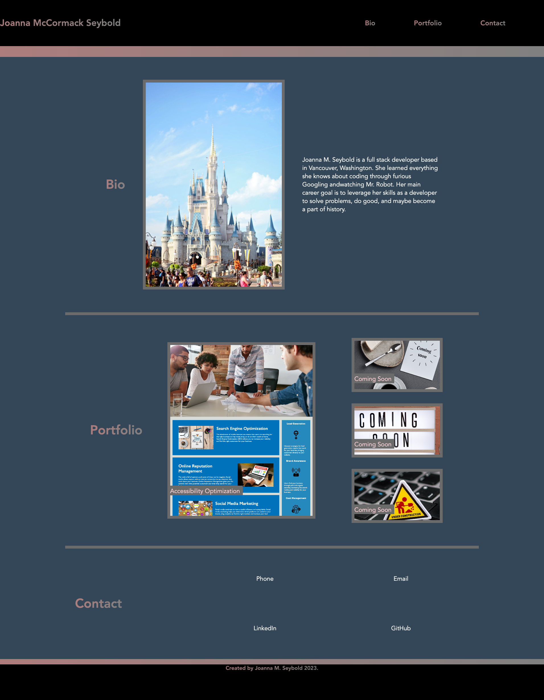

# Joanna's Bootcamp Portfolio

## Description

This web application was created as a place to store future works in order to showcase my skills to prospective employers. This was my first full web app created and solidified many concepts through repeated trial and error.

## Usage

-Use the navigation links to scroll to the three separate sections of the page. 

-Use the bio to get to know me.

-Portfolio to view my recent work. 

-Contact section to tell me that I am hired!

## Link

